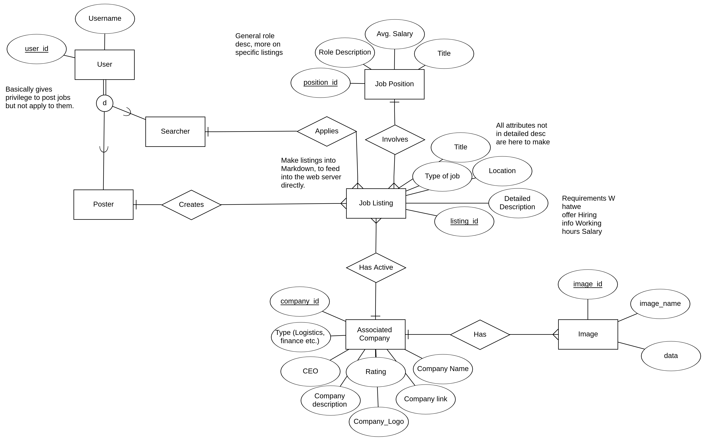

# Amazing_Job_Finder
[](https://codecov.io/gh/AngelosAnagnostopoulos/Amazing_Job_Finder)
[](https://app.fossa.com/projects/git%2Bgithub.com%2FAngelosAnagnostopoulos%2FAmazing_Job_Finder?ref=badge_shield)
## Authors: Angelos Anagnostopoulos, Michalis Drosiadis

This is a VERY overengineered attempt at creating a website for the the lesson "Network programming" of the 8th semester of 2022 in the [ECE department of UoP](http://www.ece.upatras.gr/index.php/en/).

### Demo request paths showcasing the application's functionality:

A client requests www.awesomejobfinder.com on the DNS and receives an IP from the A records resolving to the load balancer. The load balancer then serves a server through the roudrobin algorithm.

---User requests READ---
A user clicks on "Search Jobs" and enters "Patras" as location, a query is made through the read API to the redis cache. On hit, data is returned to user. On miss, the appropriate postgres replica database is queried to get the results. The results are then first cached in redis and then served to the user. 

---User requests WRITE---
There are essentially 2 types of users. Job seekers and job posters. The job poster logs into the application by sending a request to the authentication API, which takes his credentials and asks AuthDB for a user with that username/password combination. On success, it fetches the user info with his ID as the key from the Postgresql and handles the privilege escalation. A job poster then lists a job under "Full-stack Developer". Then the request is cached with Redis (To show most recent listings) and sent to Postgres (Both replica and master).

### Using the application:
We have made all the necessary configurations for the application to run with minimal user input.
First, install docker and docker-compose on your machine. Then clone the repository, go to the root project directory and run the containers (Optionally add the -d flag to keep using your terminal instance).
```sh
$ sudo apt update -y
$ sudo apt install -y docker docker.io docker-compose
$ git clone https://github.com/AngelosAnagnostopoulos/Amazing_Job_Finder.git && cd Amazing_Job_Finder
$ sudo docker-compose up
```

Once the images are pulled and the containers downloaded, you should be able to visit localhost:8080 and see a webpage. 
Alternatively, use:
```sh
$ curl localhost:8080
```
We can also connect to the containers manually in order to verify our application is properly set up and is behaviouring as expected. Below are the commands for connecting to the database containers :
We ve set 'example' as the password for our databases and 'angelos' as the user.
```sh
$ sudo docker exec -it pdb psql -U angelos app  #\dt returns all tables. SELECT * FROM company;
$ sudo docker exec -it rdb redis-cli            #get <key> returns the value of given key.
$ sudo docker exec -it mdb -u angelos -p        #use authDB. db.users.find();
```

### Technologies used:
- Frontend: HTML5, CSS3, Bootstrap, SASS, Handlebars
- APIs: NodeJS, Javascript
- Servers/LoadBalancing: Nginx
- Backend: Redis, PostgreSQL, MongoDB
- Utils: Git/Github, Github Actions,Codecov ,Docker/Docker-compose
- NodeJS:  Mocha, Istanbul (nyc)

### Systems Design:
The key idea in mind while creating the systems design was scalability and reliability. We did not get so far as to implement a CDN or multiple backend database nodes because that would be overkill even for our standards, but most of the systems found inside a modern web application are here! 
First of all, everything is made with the microservice model in mind and all services are containerized and tested. 
We 've created multiple web servers to serve our content, that are accessed through an nginx load balancer for high performance and availability.
Seperate APIs have been created to handle read/write operations to our databases, and an authentication API is also there to check user priviledges.
A Redis cache database has been added for efficient content delivery.
An authentication (MongoDB) database is used for storing user credentials.
A PostgreSQL database is the main source of truth in the web-app, but it is queried indirectly, through read-replicas in order to maximize efficiency in storing loads of data.
Microservices have been designed to handle all major functionality inside the website. They are loosely attached to the APIs responsible for each proccess.

Below is a diagram showcasing our design in detail, as well as providing some usecases that our application handles.


### Database Design:
The PostgreSQL master database ERD is shown below.
Each one of the read replicas holds table information regarding a specific range. 

The Redis database essentially copies data from our PostgreSQL so the schemas are identical. Maikng the two work together is a bit tricky but no further database configuration is needed.
The MongoDB "schema" is essentially a single collection with listings for a username and a password (hash).


### CI/CD:
Updated workflows and package.json.
Added codecov integration for testing details.

### Todolist:
- Design systems and databases. **Done**
- Create project skeleton. **Done**
    - Create the database containers and write the initialization scripts. **Done**
    - Spin up all necessary containers and put them in a docker-compose.yml file. **Done**
- Set up first CI/CD draft. **Done**
- Figure out testing details and update ci/cd workflows to use specific directories. **Done**
- Create a frontend template (first conceptualy, then in html/css/). **Done (needs to be made in code)**
- Get database read-replicas up and running. **Done**
- Add functionality to handle zip codes and cities.
- Write basic APIs to test databases and interconnectivity (Simple 200 OK responses will do).
- Make webpage responsive by adding javascript.
- Extend API functionality and implement microservices.

##### Microservices:
- Job Info (Fetch job information on a read request)
- User Info (Fetch user information and send to recommender system or to the job post service to autocomplete corresponding fields)
- Recommender (Show user recommendations based on their activity. Most likely gonna use google or not bother at all with this)
- Sign-up (Create a new user listing on the backend with specified privileges)
- Job Post (Create a job listing)
- Log-in 

##### ReadAPI
1) Query the redis database to ask for cached information.
2) Query the postgres database to ask for the absolute truth.
3) If data is received from postgres, cache to redis via WriteAPI

##### WriteAPI
1) Receive post 
2) Ask for authentication via AuthAPI.
3) Create a post request for a job listing in markdown format. This will then be fed directly into the html
4) Accept a pending job listing and make it permanent.

##### AuthAPI
1) Query the mongo database for user credentials and check against onces received from WriteAPI
2) On failure, return error, on success use the user's ID to query the postgres database and return user info plus the user's permissions (We assume that all authenticated users have permission to list jobs but not accept them. All authenticated employees have permissions for both. This model will most likely change as stated above). There is no need for cache since a mongo query on a single table with a single key is good enough for any application.


> Notes: 
> Add limit on job_post creation on the poster role to prevent attacks.
> There are MAJOR security flaws detected on our NodeJS packages, which we 'll pretend don't exist.


## License
[](https://app.fossa.com/projects/git%2Bgithub.com%2FAngelosAnagnostopoulos%2FAmazing_Job_Finder?ref=badge_large)