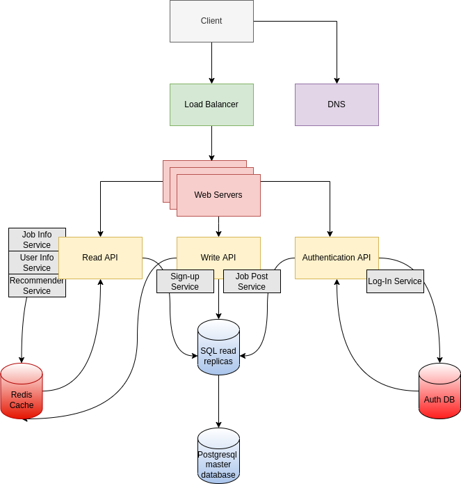

# Amazing_Job_Finder

## Authors: Angelos Anagnostopoulos, Michalis Drosiadis

This is a VERY overengineered attempt at creating a website for the the lesson "Network programming" of the 8th semester of 2022 in the [ECE department of UoP](http://www.ece.upatras.gr/index.php/en/).

### Technologies used:
Frontend: HTML5, CSS3, Bootstrap, SASS, Handlebars
APIs: NodeJS, Javascript
Servers/LoadBalancing: Nginx
Backend: Redis, PostgreSQL, MongoDB
Utils: Git/Github, Github Actions,Codecov ,Docker/Docker-compose
NodeJS:  Mocha, Istanbul (nyc)

### Systems Design:
The key idea in mind while creating the systems design was scalability and reliability. We did not get so far as to implement a CDN or multiple backend database nodes because that would be overkill even for our standards, but most of the systems found inside a modern web application are here! 
First of all, everything is made with the microservice model in mind and all services are containerized and tested. 
We 've created multiple web servers to serve our content, that are accessed through an nginx load balancer for high performance and availability.
Seperate APIs have been created to handle read/write operations to our databases, and an authentication API is also there to check user priviledges.
A Redis cache database has been added for efficient content delivery.
An authentication (MongoDB) database is used for storing user credentials.
A PostgreSQL database is the main source of truth in the web-app.

Below is a diagram showcasing our design in detail, as well as providing some usecases that our application handles.

### Database Design:
The PostgreSQL schema is shown below.

The Redis database essentially copies data from our PostgreSQL so the schemas are identical. Maikng the two work together is a bit tricky but no further database configuration is needed.
The MongoDB "schema" is essentially a single collection with listings for a username and a password (hash).

### CI/CD:
Updated workflows and package.json.
Added codecov integration for testing details.
Postgresql workflow missing.

### Todolist:
- Design systems and databases. **Done**
- Create project skeleton. **Done**
    - Create the database containers and write the initialization scripts. **Done**
    - Spin up all necessary containers and put them in a docker-compose.yml file. **Done**
- Set up first CI/CD draft. **Done**
- Figure out testing details and update ci/cd workflows to use specific directories. **Done**
- Create a frontend template (first conceptualy, then in html/css). **Done (needs to be made in code)**
- Write basic APIs to test databases and interconnectivity (Simple 200 OK responses will do).
- Extend API functionality.

##### ReadAPI
1) Query the redis database to ask for cached information.
2) Query the postgres database to ask for the absolute truth.
3) If data is received from postgres, cache to redis via WriteAPI

##### WriteAPI
1) Receive post 
2) Ask for authentication via AuthAPI.
3) Create a post request for a job listing in markdown format. This will then be fed directly into the html
4) Accept a pending job listing and make it permanent.

Notes: 
Add limit on job_post creation on the poster role to prevent attacks.

##### AuthAPI
1) Query the mongo database for user credentials and check against onces received from WriteAPI
2) On failure, return error, on success use the user's ID to query the postgres database and return user info plus the user's permissions (We assume that all authenticated users have permission to list jobs but not accept them. All authenticated employees have permissions for both. This model will most likely change as stated above). There is no need for cache since a mongo query on a single table with a single key is good enough for any application.
